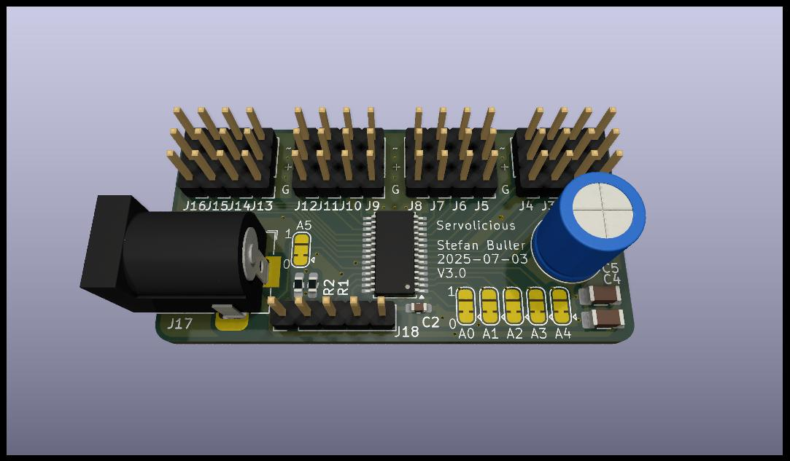

A 16 port servo controller. Supply +5V, SDA and SCL.

Servo control is generally pulse widths of 1000-2000us, produced at 50Hz where
one wavelength is 20ms. The PCA9685 does 12bit PWM, counting to 4096. Each
count corresponds to 4.883 us. 1000us is a count of 204.7. A count of 204 should
thus drive a servo fully to one side. 2000us is then 409.4. A count of 410 should
thus drive a servo fully to the other side.

Let x be the position to drive the servo to, between 0 and 1.

y = round( x * (410-204) + 204 )

Now y is the count for which each pulse should be held high.

Phase isn't likely to be important. Set LEDn_ON to 0. Set LEDn_OFF to y.


If necessary, the resolution of the PWM can be improved. By scaling the clock
and adjusting the PWM for each segment, finer control may be managed.

```
Segments: 10
Clock: 500Hz
Segment 1: 2048-4096
Segment 2-10: off
```

```
Segments: 4
Clock: 200Hz
Segment 1: 819-1639
Segments 2-4: off
```

```
Segments: 5
Clock: 250Hz
Segment 1: 1024-2048
Segments 2-5: off
```

```
Segments: 20
Clock: 1000Hz
Segment 1: on
Segment 2: 0-4096
Segments 3-20: off
```

If not controlling /OE and CLK from the uC, pull low. R1 and R2 are
provided for this purpose.
